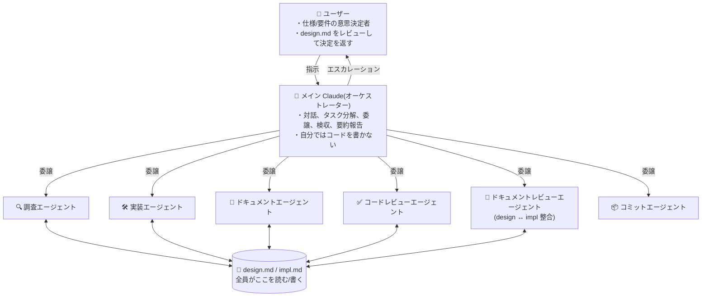

# USAGE — 4 スキルを組み合わせた開発ワークフロー

> English version: [USAGE.md](./USAGE.md)

このリポジトリの中でも、以下の 4 スキルは互いに参照し合い、1 つの開発ワークフローとして機能します。

- [`subagent-orchestration`](./subagent-orchestration/SKILL.md) — メインエージェントをオーケストレーター化
- [`design-impl-docs`](./design-impl-docs/SKILL.md) — `design.md` / `impl.md` によるコンテキスト管理
- [`implement-review-loop`](./implement-review-loop/SKILL.md) — 実装 → レビュー → 記録 → 対応の反復ループ
- [`code-review-agent`](./code-review-agent/SKILL.md) — 5 レンズ並列 + confidence scoring のコードレビュー

他のスキル（`ts-type-safety`, `neverthrow-*`, `commit-workflow` など）はこのワークフローと独立に、単独でも組み合わせても利用できます。

## 全体像

役割と情報の流れは、以下の図が端的に表しています。



この体制と情報流を規約化しているのが、以下 4 スキルの積み重ねです。

## 4 スキルの関係

```
[User] ⇄ [Main agent : subagent-orchestration]
              │
              │ 常にコンテキスト源として参照
              ├──▶ design-impl-docs
              │      ├─ design.md  （仕様・要件、User + Claude 編集）
              │      └─ impl.md    （実装詳細、Claude のみ編集）
              │
              │ 実装フェーズを委譲
              ▼
        implement-review-loop
              │   実装 → lint → レビュー（コード + docs 並列）→
              │   分類 → 記録 → 対応 の反復
              │
              │ step 3a: コードレビュー          step 3b: docs レビュー
              ▼                                   ▼
        code-review-agent                ドキュメントレビューエージェント
        5 レンズ並列                     （subagent-orchestration の
        Haiku confidence scoring          役割定義。独立スキル無し）
        閾値フィルタ                       design.md ↔ impl.md 整合を
                                           impl 著者とは別エージェントで
                                           検証（author != reviewer）
```

- **`subagent-orchestration`** が最上位の規約。メインエージェントは対話・意思決定に徹し、作業は全てサブエージェントに委譲する。
- **`design-impl-docs`** は全フェーズ共通の土台。仕様は `design.md`、実装詳細は `impl.md` に集約する。
- **`implement-review-loop`** は実装フェーズ専用のサブワークフロー。`subagent-orchestration` の配下で動く。
- **`code-review-agent`** は `implement-review-loop` の step 3（レビュー）で呼ばれる、レビュー専用のサブワークフロー。

## 典型的なセッションの流れ

1. **タスク受領** — ユーザーが機能追加・修正・調査などを依頼する。
2. **ドキュメント準備**（`design-impl-docs`）— メインエージェントが該当タスクの `design.md`（仕様・要件）を確認し、無ければ作成する。**`impl.md` は upfront には作らない** — ループ内で最初に記録が発生するタイミングで生成する（空ファイルを先置きしても中身が無い）。
3. **仕様の空白を埋める**（`subagent-orchestration` + `design-impl-docs`）— 曖昧な仕様・要件はサブエージェントにもオーケストレーター自身にも判断させない。**質問・選択肢・トレードオフ・推奨を `design.md` の「未決事項」に書き込み**、チャットでは「`design.md` の未決事項に判断を記入してください」とだけ伝えて停止する。**チャットで選択肢を並べたり、Q&A のやり取りを繰り返したり、口頭合意で先に進んだりしない**（発生源がサブエージェントでも、オーケストレーター自身が気づいた場合でも同じ）。ユーザーが `design.md` に判断を書き込んだら、`design-impl-docs` の規約に従って「決定事項」に転記する。
4. **実装フェーズ開始**（`implement-review-loop`）— `design.md` が揃った状態で反復ループを開始（反復カウンタ N = 1）。`impl.md` は未存在でも問題無く、ループの初回記録時に生成される。
5. **ループ 1 周**:
   - 実装エージェントに委譲（`impl.md` が未生成なら完了時に作成 + 構成・実装状況を記録）
   - lint チェック（Claude Code hook 優先、なければオーケストレーター実行）
   - **レビューを 2 系統並列で走らせる:**
     - **3a. コードレビュー** — `code-review-agent` に委譲（5 レンズ並列 → Haiku confidence scoring → 閾値未満を捨てる）
     - **3b. ドキュメントレビュー** — `subagent-orchestration` に定義された**ドキュメントレビューエージェント役**に委譲（独立スキル無し）。**impl.md を書いた実装エージェントとは別のエージェント**を必ず使う（author != reviewer 担保）。観点は design.md の決定事項が impl.md の実装状況に反映されているか / impl.md の技術的判断が仕様と矛盾していないか / 未決事項が勝手に実装済み扱いされていないか / 履歴不整合。`impl.md` の構造セクション（構成・技術的判断・実装状況）に変化が無い周は skip 可
   - コード + docs 指摘を合流させ「仕様・設計」と「実装判断」に分類
   - 仕様・設計は `design.md` 経由でユーザーへエスカレーション（step 3 と同じプロトコル — 未決事項に書き、チャットはポインタのみ）、それ以外は `impl.md` に周ごと記録（各指摘に `出所: code / docs` タグを付ける）
   - 対応をサブエージェントに委譲し N++（コード修正伴う → 実装エージェント、`impl.md` の書き換えのみで閉じる → ドキュメントエージェント）
6. **停止条件** — 「コード + docs レビュー指摘とも 0 件 + lint 通過 + 未決事項なし」に達したら、ループの最終 step として **コミットエージェント** に委譲してコミットまで完了させる（`subagent-orchestration` の「git 操作の扱い」参照、プロジェクトに `commit-workflow` などのコミット規約スキルがあれば従わせる）。オーケストレーターは `git add` / `git commit` を直接叩かない。**ユーザーへの動作確認依頼はデフォルトでは省略** — UI/UX に触れる変更、外部システム・不可逆な副作用に触れる変更、`design.md` に動作確認要と明記された項目、ループ内でのユーザー判断内容を目視確認したい場合、のいずれかに該当する場合のみ添える。純粋な内部変更（リファクタリング・型修正・レビュー指摘対応のみ）は完了報告のみで終了する。N == 3 で未達なら `design.md` 未決事項に状況・選択肢・推奨を記録してユーザーへエスカレーション。

> **hook を使った補強（任意）**
> `implement-review-loop` は最終 step でコミットエージェントに委譲してコミットまで完了しますが、機械的な安全網が欲しい場合は次の 2 種類の hook を別々に組めます:
> - **コミット時のスキル呼び出し** — プロジェクトに独自のコミット規約（例: `commit-workflow`）がある場合、Claude Code の PreToolUse hook や `pre-commit` の git hook でそのスキルを起動しておけば、どの経路からコミットが走っても規約が適用される
> - **オーケストレーターの直コミット防止** — `Bash(git commit:*)` を `permissions.ask` に入れると、オーケストレーターが誤って自分で叩こうとした場合にユーザー確認が挟まる（コミットエージェント経由なら期待通り通る）
>
> これらはプロジェクト側のインフラ設定であって、本スキルの責務ではありません。ループは「実装フェーズの成功時にコミットエージェント経由でコミットが走る」ことを前提にしています。

## どこから読み始めるか

用途に応じて入口を選んでください。

| やりたいこと | 入口 |
|--------------|------|
| 4 スキルを丸ごと導入して開発ワークフローを再構築したい | `subagent-orchestration` → `design-impl-docs` → `implement-review-loop` → `code-review-agent` の順に読む |
| セッション再開・コンテキスト共有の運用だけ導入したい | `design-impl-docs` 単独 |
| 実装フェーズを反復ループ化したい（既に `design.md` 運用がある） | `design-impl-docs` を軽く確認 → `implement-review-loop` |
| レビューだけ 5 レンズ化したい | `code-review-agent`（前提として `design.md` が必要。`impl.md` は無くてもよい） |

## 依存関係のまとめ

| スキル | 前提 | 呼び出し先 |
|--------|------|-----------|
| `subagent-orchestration` | サブエージェントが利用可能な環境 | `design-impl-docs`（コンテキスト源） / `implement-review-loop`（実装フェーズ） |
| `design-impl-docs` | — | — |
| `implement-review-loop` | `design.md` が整備済み（`impl.md` はループ内で生成） | `code-review-agent`（step 3 レビュー） |
| `code-review-agent` | `design.md` が整備済み、`impl.md` があれば追加コンテキストとして渡す、サブエージェントが利用可能 | — |
