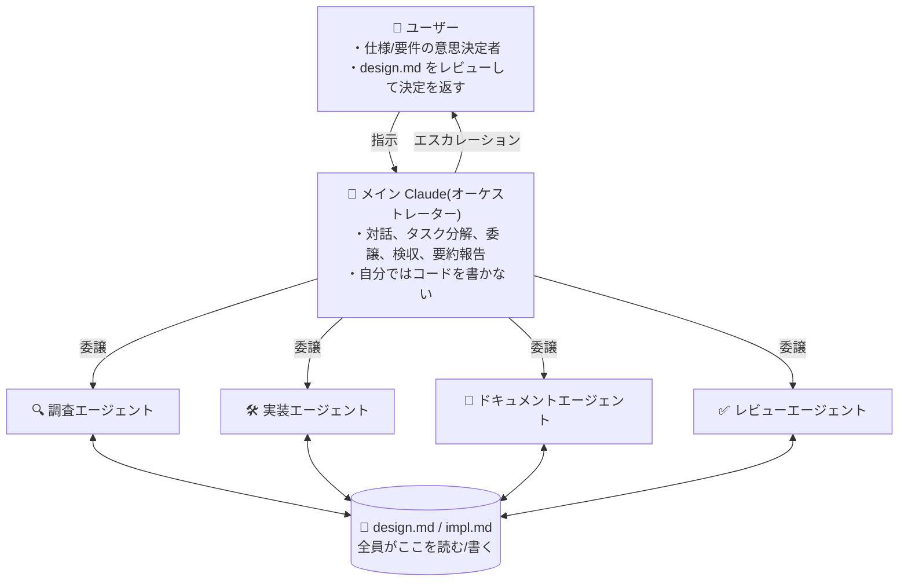

# USAGE — 4 スキルを組み合わせた開発ワークフロー

> English version: [USAGE.md](./USAGE.md)

このリポジトリの中でも、以下の 4 スキルは互いに参照し合い、1 つの開発ワークフローとして機能します。

- [`subagent-orchestration`](./subagent-orchestration/SKILL.md) — メインエージェントをオーケストレーター化
- [`design-impl-docs`](./design-impl-docs/SKILL.md) — `design.md` / `impl.md` によるコンテキスト管理
- [`implement-review-loop`](./implement-review-loop/SKILL.md) — 実装 → レビュー → 記録 → 対応の反復ループ
- [`code-review-agent`](./code-review-agent/SKILL.md) — 5 レンズ並列 + confidence scoring のコードレビュー

他のスキル（`ts-type-safety`, `neverthrow-*`, `commit-workflow` など）はこのワークフローと独立に、単独でも組み合わせても利用できます。

## 全体像

役割と情報の流れは、以下の図が端的に表しています。



この体制と情報流を規約化しているのが、以下 4 スキルの積み重ねです。

## 4 スキルの関係

```
[User] ⇄ [Main agent : subagent-orchestration]
              │
              │ 常にコンテキスト源として参照
              ├──▶ design-impl-docs
              │      ├─ design.md  （仕様・要件、User + Claude 編集）
              │      └─ impl.md    （実装詳細、Claude のみ編集）
              │
              │ 実装フェーズを委譲
              ▼
        implement-review-loop
              │   実装 → lint → レビュー → 分類 → 記録 → 対応 の反復
              │
              │ step 3（レビュー）で呼び出し
              ▼
        code-review-agent
              5 レンズ並列 → Haiku confidence scoring → 閾値フィルタ
```

- **`subagent-orchestration`** が最上位の規約。メインエージェントは対話・意思決定に徹し、作業は全てサブエージェントに委譲する。
- **`design-impl-docs`** は全フェーズ共通の土台。仕様は `design.md`、実装詳細は `impl.md` に集約する。
- **`implement-review-loop`** は実装フェーズ専用のサブワークフロー。`subagent-orchestration` の配下で動く。
- **`code-review-agent`** は `implement-review-loop` の step 3（レビュー）で呼ばれる、レビュー専用のサブワークフロー。

## 典型的なセッションの流れ

1. **タスク受領** — ユーザーが機能追加・修正・調査などを依頼する。
2. **ドキュメント準備**（`design-impl-docs`）— メインエージェントが該当タスクの `design.md` / `impl.md` を確認し、なければ作成する。
3. **仕様の空白を埋める**（`subagent-orchestration` + `design-impl-docs`）— 曖昧な仕様・要件はサブエージェントに勝手に判断させず、選択肢と推奨をユーザーに提示 → 決定を `design.md` に記録する。
4. **実装フェーズ開始**（`implement-review-loop`）— `design.md` / `impl.md` が揃った状態で反復ループを開始（反復カウンタ N = 1）。
5. **ループ 1 周**:
   - 実装エージェントに委譲
   - lint チェック（Claude Code hook 優先、なければオーケストレーター実行）
   - **レビューエージェントに委譲**（`code-review-agent`）— 5 レンズ並列 → Haiku confidence scoring → 閾値未満を捨てる
   - 指摘を「仕様・設計」と「実装判断」に分類
   - 仕様・設計は `design.md` 経由でユーザーへエスカレーション、それ以外は `impl.md` に周ごと記録
   - 対応を実装エージェントに委譲し N++
6. **停止条件** — 「レビュー指摘 0 件 + lint 通過 + 未決事項なし」に達したらユーザーに動作確認を依頼して終了。N == 3 で未達なら `design.md` 未決事項に状況・選択肢・推奨を記録してユーザーへエスカレーション。

## どこから読み始めるか

用途に応じて入口を選んでください。

| やりたいこと | 入口 |
|--------------|------|
| 4 スキルを丸ごと導入して開発ワークフローを再構築したい | `subagent-orchestration` → `design-impl-docs` → `implement-review-loop` → `code-review-agent` の順に読む |
| セッション再開・コンテキスト共有の運用だけ導入したい | `design-impl-docs` 単独 |
| 実装フェーズを反復ループ化したい（既にドキュメント運用がある） | `design-impl-docs` を軽く確認 → `implement-review-loop` |
| レビューだけ 5 レンズ化したい | `code-review-agent`（前提として `design.md` / `impl.md` が揃っている必要あり） |

## 依存関係のまとめ

| スキル | 前提 | 呼び出し先 |
|--------|------|-----------|
| `subagent-orchestration` | サブエージェントが利用可能な環境 | `design-impl-docs`（コンテキスト源） / `implement-review-loop`（実装フェーズ） |
| `design-impl-docs` | — | — |
| `implement-review-loop` | `design.md` / `impl.md` が整備済み | `code-review-agent`（step 3 レビュー） |
| `code-review-agent` | `design.md` / `impl.md` が整備済み、サブエージェントが利用可能 | — |
