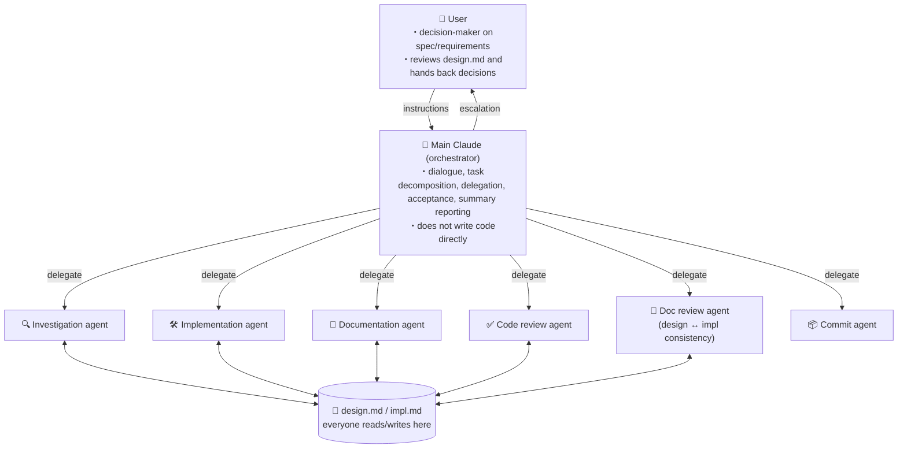

# USAGE — Development Workflow with the Four Interlocking Skills

> Japanese version: [USAGE.ja.md](./USAGE.ja.md)

Among the skills in this repository, the following four reference each other and together form a single development workflow:

- [`subagent-orchestration`](./subagent-orchestration/SKILL.md) — turns the main agent into an orchestrator
- [`design-impl-docs`](./design-impl-docs/SKILL.md) — context management via `design.md` / `impl.md`
- [`implement-review-loop`](./implement-review-loop/SKILL.md) — implement → review → record → fix iteration loop
- [`code-review-agent`](./code-review-agent/SKILL.md) — 5-lens parallel review + confidence scoring

The other skills (`ts-type-safety`, `neverthrow-*`, `commit-workflow`, etc.) are independent of this workflow and can be used standalone or in combination as needed.

## The big picture

Roles and information flow are captured concisely by the diagram below.



The four skills below stack up to formalize this structure and information flow as conventions.

## How the four skills relate

```
[User] ⇄ [Main agent : subagent-orchestration]
              │
              │ referenced as the context source throughout
              ├──▶ design-impl-docs
              │      ├─ design.md  (spec/requirements, edited by User + Claude)
              │      └─ impl.md    (implementation details, edited by Claude only)
              │
              │ delegates the implementation phase
              ▼
        implement-review-loop
              │   implement → lint → review (docs → code, sequential) →
              │   classify → record → fix (looped)
              │
              │ step 3a: doc review runs first (fast, 2 files)
              ▼
        Document review agent (a role defined in subagent-orchestration —
        no separate skill). Checks design.md ↔ impl.md consistency
        with a reviewer ≠ author guarantee.
          → drift findings that are impl.md-only get fixed IMMEDIATELY
             (via the documentation agent, without waiting for step 6)
          → spec/design escalations halt the loop until the user decides
          → clean impl.md is then passed to step 3b
              │
              │ step 3b: code review runs on the reconciled impl.md
              ▼
        code-review-agent
        5 lenses in parallel → Haiku confidence scoring → threshold filter
```

- **`subagent-orchestration`** is the top-level convention. The main agent focuses on dialogue and decision-making, delegating all work to subagents.
- **`design-impl-docs`** is the shared foundation across every phase. Specs live in `design.md`, implementation details in `impl.md`.
- **`implement-review-loop`** is a sub-workflow dedicated to the implementation phase. It runs under `subagent-orchestration`.
- **`code-review-agent`** is a review-only sub-workflow invoked at step 3 (review) of `implement-review-loop`.

## A typical session flow

> **Core rule: every `impl.md` creation or edit is paired with a doc review.** Any time `impl.md` is written to — the upfront creation in Step 2, or any structural update inside a Step 5 iteration — a doc review by a **different agent from the author** (reviewer ≠ author) must run immediately. Skipping the pairing, batching it, or letting the author self-review is not allowed. Drift findings are resolved on the spot; spec/design escalations halt forward progress via `design.md`'s open-questions section until the user decides.

1. **Task received** — the user requests a feature, fix, or investigation.
2. **Doc setup** (`design-impl-docs`) — the main agent checks/creates the task's `design.md` (spec/requirements). **`impl.md` must also be created before entering the implementation phase, and creation is paired with an immediate doc review** (per the core rule above):
   - **2a. Create `impl.md`** — delegate to a documentation agent to write structure, technical decisions, implementation steps, and the commit-split plan upfront so the approach is locked in before any code is written.
   - **2b. Review `impl.md`** — delegate to a **different** agent (reviewer ≠ author) to check `design.md` ↔ `impl.md` consistency: are the design decisions reflected? are the technical judgments compatible with the spec? are any open questions accidentally treated as resolved? Findings that can be fixed inside `impl.md` go back to the documentation agent immediately; spec/design escalations go to `design.md`'s open-questions section and halt entry into the loop until the user decides.
   - Do not enter Step 4 with an unreviewed `impl.md`.
3. **Fill in spec gaps** (`subagent-orchestration` + `design-impl-docs`) — never let subagents guess on ambiguous specs. **Write the question, options, trade-offs, and recommendation into `design.md`'s open-questions section**; in chat, say only *"I've added open questions to `design.md` — please write your decision there."* Do **not** list options in chat, do not run Q&A back-and-forth in chat, do not accept verbal decisions without persisting them to `design.md`. This applies regardless of who surfaced the question (a subagent, or the orchestrator noticing a gap on its own). Once the user writes a decision into `design.md`, move it to the decisions section per `design-impl-docs` rules.
4. **Enter the implementation phase** (`implement-review-loop`) — with both `design.md` and `impl.md` in place, start the iteration loop (counter N = 1). Entering the loop with `impl.md` missing is not allowed.
5. **One iteration**:
   - Delegate to an implementation agent (updates the relevant sections of `impl.md`)
   - Run lint (prefer Claude Code hook; if absent, run from the orchestrator)
   - **Run two reviews sequentially (docs first, then code):**
     - **3a. Document review** — delegate to a **document review agent** (a role defined in `subagent-orchestration`, no separate skill). Must be a **different agent from the one that wrote `impl.md`** (reviewer ≠ author). It checks `design.md` ↔ `impl.md` consistency: decisions reflected? technical judgments compatible with the spec? open questions accidentally treated as resolved? historical drift? This pass fires whenever `impl.md` was edited in the iteration (per the core rule) and may only be skipped when `impl.md`'s structural sections (構成 / 技術的判断 / 実装状況) were not touched at all.
     - **3a-fix (immediate)** — resolve docs findings on the spot: `impl.md`-only fixes go to the documentation agent right away (don't wait for step 6); spec/design escalations (仕様乖離 / 未決先取り) halt the loop via `design.md`'s open-questions section until the user decides. This guarantees a **reconciled `impl.md`** before 3b.
     - **3b. Code review** — delegate to `code-review-agent` with the freshly-reconciled `impl.md` as the reference (5 lenses in parallel → Haiku confidence scoring → drop items below the threshold). Lens 2 (internal consistency) is now reliable.
   - Classify 3b findings as either "spec/design" or "implementation judgment" (3a findings are already resolved above)
   - Escalate spec/design findings via `design.md` (same protocol as step 3 — write to open-questions, chat is pointer-only); record the rest in `impl.md` per iteration with an `出所: code / docs` tag (docs entries retained for traceability even though already applied)
   - Delegate code fixes to the implementation agent and increment N
6. **Stopping condition** — when "0 findings from both doc review (after 3a-fix) and code review + lint passes + no open questions" is reached, delegate to the **commit agent** as the loop's final step (see the "git operations" section of `subagent-orchestration`; the delegation prompt should point at a project-specific commit skill such as `commit-workflow` when available). The orchestrator never runs `git add` / `git commit` itself. **User verification after commit is opt-in, not default** — request it only when the change touches UI/UX, external systems or irreversible side effects, `design.md` explicitly flags verification, or user decisions in the loop need visual confirmation. For pure internal changes (refactors, type fixes, review-finding cleanups), just report completion and finish. If N == 3 without meeting the condition, record status, options, and recommendation in the `design.md` open-questions section and escalate to the user.

> **Note on hook-based enforcement (optional)**
> `implement-review-loop` runs the final commit via a commit agent, but two orthogonal hook setups can back it up if you want a mechanical safety net:
> - **Commit-time skill invocation** — if a project has its own commit conventions (e.g. `commit-workflow`), a Claude Code PreToolUse hook or a `pre-commit` git hook can invoke that skill so the convention is applied regardless of which caller triggered the commit.
> - **Preventing orchestrator direct-commit** — putting `Bash(git commit:*)` into `permissions.ask` catches cases where the orchestrator would otherwise call git directly (commit-agent-driven commits still go through as expected).
>
> These are project-level infrastructure choices, not part of this skill. The loop assumes only that a commit — routed through the commit agent — happens at the end of a successful iteration.

## Where to start reading

Pick an entry point based on your goal.

| Goal | Entry point |
|------|-------------|
| Adopt the whole workflow across all four skills | Read `subagent-orchestration` → `design-impl-docs` → `implement-review-loop` → `code-review-agent` in that order |
| Only need session resumption / context sharing | `design-impl-docs` alone |
| Want the implementation phase as an iteration loop (`design.md` already in place) | Skim `design-impl-docs`, then `implement-review-loop` |
| Only want to switch reviews to the 5-lens style | `code-review-agent` (requires `design.md`; `impl.md` may be absent at first) |

## Dependency summary

| Skill | Prerequisites | Invokes |
|-------|---------------|---------|
| `subagent-orchestration` | Environment with subagent (Task/Agent) tools available | `design-impl-docs` (context source) / `implement-review-loop` (implementation phase) |
| `design-impl-docs` | — | — |
| `implement-review-loop` | Both `design.md` and `impl.md` are prepared, and `impl.md` has passed its initial doc review (reviewer ≠ author) before entering the loop | `code-review-agent` (step 3 review) |
| `code-review-agent` | `design.md` is prepared; `impl.md` if it exists is passed as extra context; subagents available | — |
