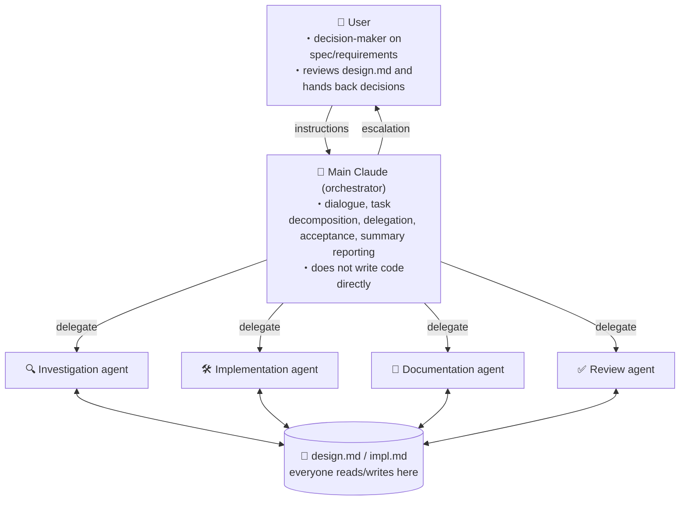

# USAGE — Development Workflow with the Four Interlocking Skills

> Japanese version: [USAGE.ja.md](./USAGE.ja.md)

Among the skills in this repository, the following four reference each other and together form a single development workflow:

- [`subagent-orchestration`](./subagent-orchestration/SKILL.md) — turns the main agent into an orchestrator
- [`design-impl-docs`](./design-impl-docs/SKILL.md) — context management via `design.md` / `impl.md`
- [`implement-review-loop`](./implement-review-loop/SKILL.md) — implement → review → record → fix iteration loop
- [`code-review-agent`](./code-review-agent/SKILL.md) — 5-lens parallel review + confidence scoring

The other skills (`ts-type-safety`, `neverthrow-*`, `commit-workflow`, etc.) are independent of this workflow and can be used standalone or in combination as needed.

## The big picture

Roles and information flow are captured concisely by the diagram below.



The four skills below stack up to formalize this structure and information flow as conventions.

## How the four skills relate

```
[User] ⇄ [Main agent : subagent-orchestration]
              │
              │ referenced as the context source throughout
              ├──▶ design-impl-docs
              │      ├─ design.md  (spec/requirements, edited by User + Claude)
              │      └─ impl.md    (implementation details, edited by Claude only)
              │
              │ delegates the implementation phase
              ▼
        implement-review-loop
              │   implement → lint → review → classify → record → fix (looped)
              │
              │ invoked at step 3 (review)
              ▼
        code-review-agent
              5 lenses in parallel → Haiku confidence scoring → threshold filter
```

- **`subagent-orchestration`** is the top-level convention. The main agent focuses on dialogue and decision-making, delegating all work to subagents.
- **`design-impl-docs`** is the shared foundation across every phase. Specs live in `design.md`, implementation details in `impl.md`.
- **`implement-review-loop`** is a sub-workflow dedicated to the implementation phase. It runs under `subagent-orchestration`.
- **`code-review-agent`** is a review-only sub-workflow invoked at step 3 (review) of `implement-review-loop`.

## A typical session flow

1. **Task received** — the user requests a feature, fix, or investigation.
2. **Doc setup** (`design-impl-docs`) — the main agent checks the task's `design.md` / `impl.md`, and creates them if missing.
3. **Fill in spec gaps** (`subagent-orchestration` + `design-impl-docs`) — never let subagents guess on ambiguous specs; present options and a recommendation to the user, and record the decision in `design.md`.
4. **Enter the implementation phase** (`implement-review-loop`) — with `design.md` / `impl.md` in place, start the iteration loop (counter N = 1).
5. **One iteration**:
   - Delegate to an implementation agent
   - Run lint (prefer Claude Code hook; if absent, run from the orchestrator)
   - **Delegate to the review agent** (`code-review-agent`) — 5 lenses in parallel → Haiku confidence scoring → drop items below the threshold
   - Classify findings as either "spec/design" or "implementation judgment"
   - Escalate spec/design findings via `design.md`; record the rest in `impl.md` per iteration
   - Delegate fixes to the implementation agent and increment N
6. **Stopping condition** — when "0 review findings + lint passes + no open questions" is reached, ask the user for verification and finish. If N == 3 without meeting the condition, record status, options, and recommendation in the `design.md` open-questions section and escalate to the user.

## Where to start reading

Pick an entry point based on your goal.

| Goal | Entry point |
|------|-------------|
| Adopt the whole workflow across all four skills | Read `subagent-orchestration` → `design-impl-docs` → `implement-review-loop` → `code-review-agent` in that order |
| Only need session resumption / context sharing | `design-impl-docs` alone |
| Want the implementation phase as an iteration loop (docs already in place) | Skim `design-impl-docs`, then `implement-review-loop` |
| Only want to switch reviews to the 5-lens style | `code-review-agent` (requires `design.md` / `impl.md` to already exist) |

## Dependency summary

| Skill | Prerequisites | Invokes |
|-------|---------------|---------|
| `subagent-orchestration` | Environment with subagent (Task/Agent) tools available | `design-impl-docs` (context source) / `implement-review-loop` (implementation phase) |
| `design-impl-docs` | — | — |
| `implement-review-loop` | `design.md` / `impl.md` are prepared | `code-review-agent` (step 3 review) |
| `code-review-agent` | `design.md` / `impl.md` are prepared; subagents available | — |
